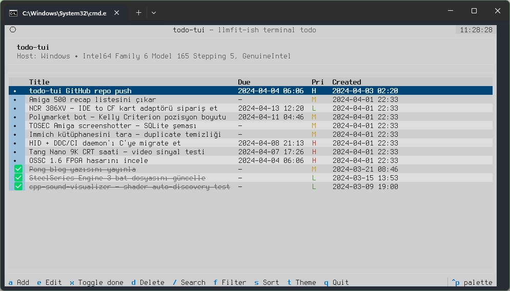
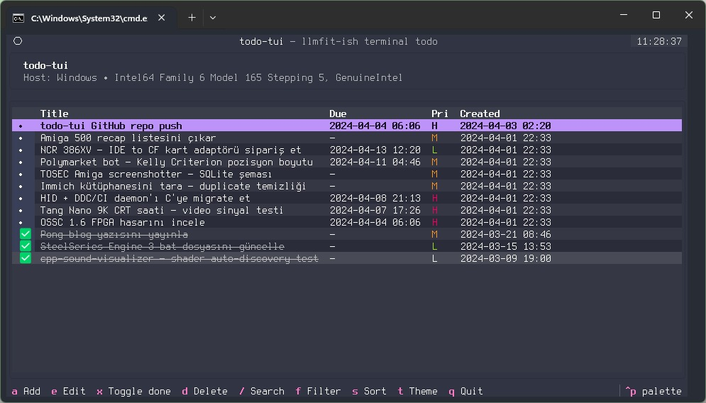
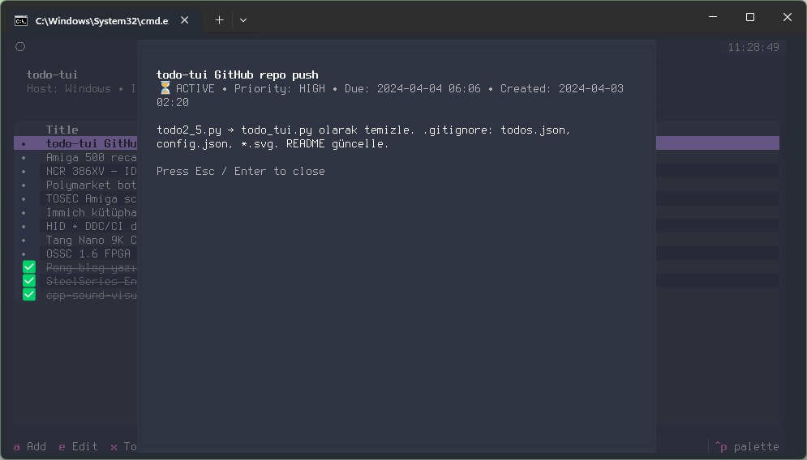
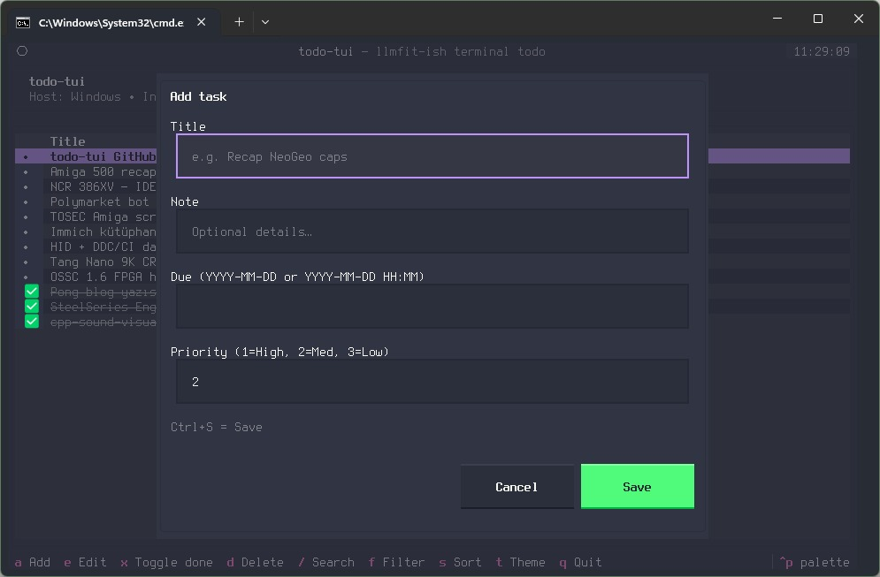

# todo-tui

A keyboard-driven terminal to-do manager built with [Textual](https://github.com/Textualize/textual).


## Features

- Add, edit, delete tasks with title, note, due date, and priority
- Toggle tasks done/active with a single key
- Filter view: **All / Active / Done**
- Sort by: **Created / Due / Priority / Title**
- Full-text search across title and notes
- Detail popup for each task
- Six built-in Textual themes (dark, light, Monokai, Dracula, Nord, Catppuccin Mocha)
- Theme preference persisted in `config.json`
- Data stored locally as `todos.json` — no server, no account

---

## Requirements

- Python 3.10+
- [Textual](https://github.com/Textualize/textual)

```bash
pip install textual
```

---

## Usage

```bash
python todo_tui.py
```

---

## Keyboard Shortcuts

| Key | Action |
|-----|--------|
| `a` | Add new task |
| `e` | Edit selected task |
| `x` | Toggle done/active |
| `d` | Delete selected task |
| `Enter` | Open task detail |
| `/` | Search tasks |
| `f` | Cycle filter (All → Active → Done) |
| `s` | Cycle sort (Created → Due → Priority → Title) |
| `t` | Cycle theme |
| `j` / `↓` | Move cursor down |
| `k` / `↑` | Move cursor up |
| `q` | Quit |

Inside the task editor:

| Key | Action |
|-----|--------|
| `Ctrl+S` | Save |
| `Esc` | Cancel |

---

## Screenshots

<a href="screenshots/screenshot_1.jpeg"></a>
<a href="screenshots/screenshot_2.jpeg"></a>
<a href="screenshots/screenshot_3.jpeg"></a>
<a href="screenshots/screenshot_4.jpeg"></a>

---

## Task Fields

| Field | Description |
|-------|-------------|
| **Title** | Required. Short summary of the task. |
| **Note** | Optional. Free-form details. |
| **Due** | Optional. Format: `YYYY-MM-DD` or `YYYY-MM-DD HH:MM` |
| **Priority** | `1` = High, `2` = Medium (default), `3` = Low |

---

## Data Files

Both files are created automatically next to the script (or the frozen executable):

| File | Contents |
|------|----------|
| `todos.json` | All tasks |
| `config.json` | Theme preference |

---

## Priority Colors

| Label | Color | Meaning |
|-------|-------|---------|
| `H` | Red | High priority |
| `M` | Yellow | Medium priority |
| `L` | Green | Low priority |

---

## Project Structure

```
todo_tui.py         # Single-file application
screenshots/        # README screenshots
todos.json          # Auto-generated task store
config.json         # Auto-generated config
```

---

## License

MIT
